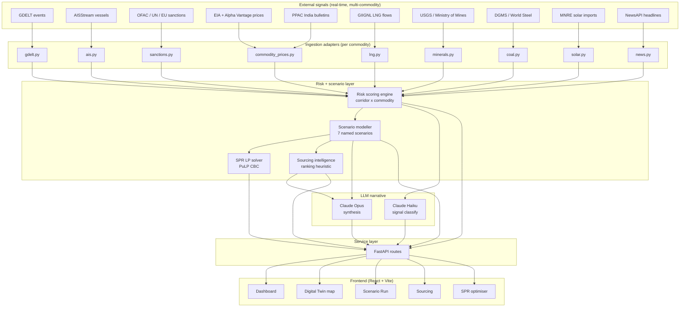

# Architecture diagram

Two renderings of the system architecture for the presentation deck — Mermaid (for digital slides) and ASCII (for export). Both describe the same system.

## Mermaid



## ASCII fallback

```
External signals (real-time, multi-commodity)
+-------+ +-----+ +------+ +-----+ +------+ +-------+ +------+ +------+ +------+ +-------+
| GDELT | | AIS | | OFAC | | EIA | | PPAC | | GIIGNL| | USGS | | DGMS | | MNRE | |NewsAPI|
+---+---+ +--+--+ +--+---+ +--+--+ +--+---+ +---+---+ +---+--+ +--+---+ +--+---+ +---+---+
    v        v        v        v        v         v         v        v        v         v
+------------------------------------------------------------------------------------------+
| Ingestion adapters                                                                        |
| gdelt.py  ais.py  sanctions.py  commodity_prices.py  lng.py  coal.py  minerals.py        |
| solar.py  news.py                                                                         |
+----+----------------+-----------------+-----------------+--------------+-----------------+
     v                v                 v                 v              v
+----------------------------------------------------------------------------------------+
|                  Risk scoring engine (corridor x commodity matrix)                      |
+-----+-----------------+--------------------+-----------------------------+--------------+
      v                 v                    v                             v
+------------+ +-------------------+ +---------------------+ +------------------+
| Scenario   | | SPR LP            | | Sourcing intel      | | LLM narrative    |
| modeller   | | (PuLP CBC)        | | (ranking heuristic) | | (Haiku + Opus)   |
| 7 named    | | reserve drawdown  | | top 5 alternatives  | | feed + brief +   |
| scenarios  | |                   | |                     | | scenario story   |
+-----+------+ +-----+-------------+ +----+----------------+ +--+---------------+
      v              v                    v                     v
+----------------------------------------------------------------------------------------+
|                  FastAPI routes  ( /scores  /scenarios  /twin  /sourcing  /spr  /feed )  |
+-----------------------------+------------------+--------------------+------------------+
                              v                  v                    v
                       +-----------+      +-----------+         +-----------+
                       | Dashboard |      | Digital   |         | Scenario  |
                       |           |      | Twin map  |         | run page  |
                       +-----------+      +-----------+         +-----------+
                                          +-----------+         +-----------+
                                          | Sourcing  |         | SPR optim |
                                          +-----------+         +-----------+
```

## Component key

| Component | Role |
|-----------|------|
| Ingestion adapters | One per data source. Async, fixture fallback when `ALLOW_LIVE_INGEST=false`. Pydantic-typed output. |
| Risk scoring engine | Composite 0-100 score per corridor x commodity. Weights: 40% geopolitical, 25% chokepoint, 15% sanctions, 20% market volatility. |
| Scenario modeller | 7 named scenarios spanning crude, LNG, coal, minerals, solar PV, uranium. Each maps inputs to cascading impact: prices, GDP bps, SPR runway. |
| SPR LP solver | PuLP CBC linear program. Decision vars: daily drawdown and replenish per SPR site. Objective: minimise integrated price-impact over horizon. |
| Sourcing intelligence | Ranks alternative suppliers by current risk + historical share + lead time. Honest about NOT validating refinery / smelter chemistry. |
| LLM narrative | Haiku for high-frequency signal classification; Opus for synthesis (executive brief, scenario narrative, recommendation drafting). Cached. |
| FastAPI | Async service layer. Tagged endpoints for auto-generated OpenAPI docs. Fixture fallback for offline demo. |
| Frontend | React + Vite + TS + Tailwind. Dark theme. Leaflet/SVG map. Recharts for time series. Zustand for state. |

## Data flow — Hormuz disruption end-to-end

```
1. GDELT poller picks up "US tanker incident in Strait of Hormuz" within 15 min of publication.

2. ingest/gdelt.py extracts: actor1=US, actor2=Iran, location=Hormuz, lat=26.5, lon=56.2,
   tone=-7.2, cameo_code=144 (THREATEN_FORCE).

3. engines/risk_score.compute_corridor_score(HORMUZ) blends:
   - geopolitical signal (this event + 17 others in last 24h) = 0.72
   - chokepoint signal (AIS vessel density 1.4 SD above 90-day mean) = 0.55
   - sanctions hit count = 0.30
   - market volatility (Brent +4.2% in 24h) = 0.65
   composite = 0.40*0.72 + 0.25*0.55 + 0.15*0.30 + 0.20*0.65 = 0.605
   score = 60.5 -> tier "high"

4. engines/scenarios.run_scenario("hormuz-closure") runs with shockSeverity=0.5, duration=14d.
   Outputs: Brent baseline 82 -> projected 107 (+30%), SPR cover 9.5d -> 5.1d,
   GDP bps -45, Inflation bps +35, route share Cape rerouting climbs from 0 to 0.42.

5. engines/spr_lp.solve_spr_plan() runs with the projected supply gap as input.
   Outputs a 60-day plan: 0.85 MB/day drawdown for first 18 days, taper, replenishment from day 32.

6. llm/summarise.narrate_scenario(result) calls Claude Opus with the structured
   ScenarioResult. Returns an analyst narrative paragraph + recommended actions.

7. POST /api/scenarios/run returns ScenarioResult (+ embedded narrative + LP outline)
   in a single response.

8. Frontend ScenarioRun page renders the four impact bars, cascade chart, narrative
   panel, and sourcing table. End-to-end latency target: under 2 seconds with fixtures,
   under 6 seconds on live APIs (LLM call is the slowest step).
```
